- [LLM models and pretraining](#llm-models-and-pretraining)
  - [Pre-training large language model types](#pre-training-large-language-model-types)
  - [LLM model training memory](#llm-model-training-memory)
  - [Impact of Quantization](#impact-of-quantization)
- [Scaling Model Training Across GPUs](#scaling-model-training-across-gpus)
  - [Distributed Data-Parallel (DDP)](#distributed-data-parallel-ddp)
  - [Fully Sharded Data Parallel (FSDP)](#fully-sharded-data-parallel-fsdp)
    - [ZeRO Technique](#zero-technique)
  - [FSDP vs DDP Performance](#fsdp-vs-ddp-performance)
- [Scaling laws and compute optimal models](#scaling-laws-and-compute-optimal-models)
  - [Compute budget](#compute-budget)
  - [Scaling choices](#scaling-choices)
  - [Chinchilla Paper](#chinchilla-paper)
  - [Future trend:](#future-trend)
- [Pre-training for domain adaptation](#pre-training-for-domain-adaptation)

# LLM models and pretraining

## Pre-training large language model types
  - Autoencoding - MLM - Encoder only
    - use case - sentence classification / token classification
  - Autoregressive - CLM - decoder only
    - use case - text generation
  - Seq-to-Seq - span corruption - encoder-decoder
    - use cases - translations, summarization, Q&A        

    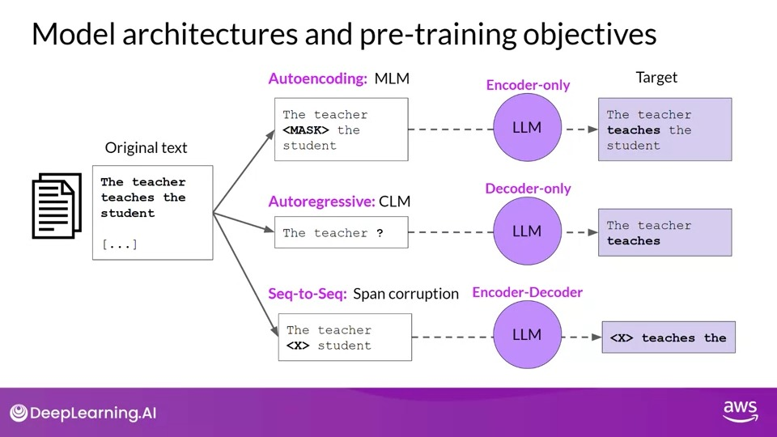
  

## LLM model training memory  
  - model param size  
     1 parameter = 4 byte (32-bit float) 
     1 billion parameters = 4 gigabyte of GPU RAM
  - Additional memory approximately 20 times of models weights in model training 
    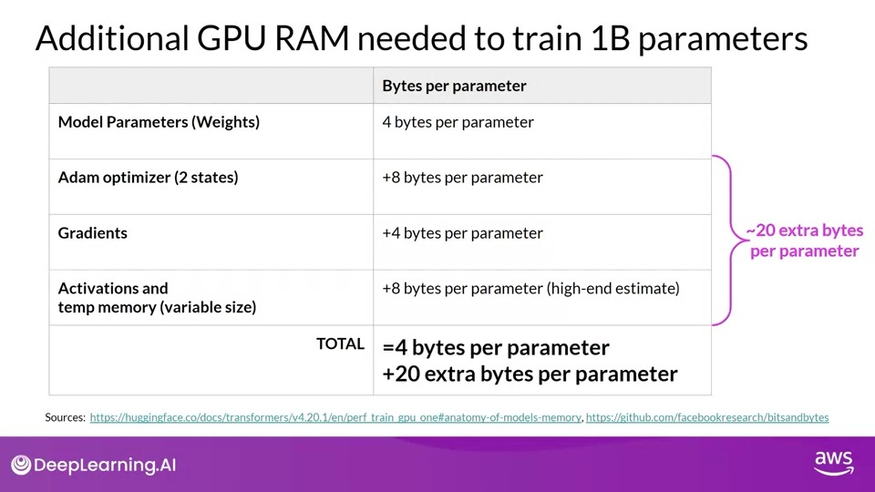

  - Memory required to **train models at 32 bit precision**
  
    1 billion param model = 20 * 4 gb = 80 GB GPU
    
    175 billion param model = 20 * 4 gb * 175 = 1400 GB GPU 

    500 billion param model = 20 * 4 gb * 500 = 40,000 GB GPU 

## Impact of Quantization

- By applying quantization, you can reduce the memory consumption for storing model parameters by 50% using 16-bit half precision, and by an additional 50% using 8-bit integers.

    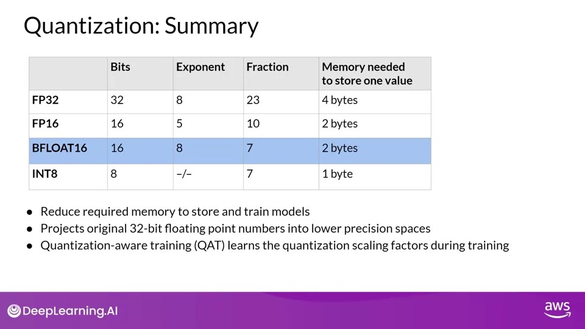

# Scaling Model Training Across GPUs
Multi-GPU compute strategies are needed when model is too large to fit into a single GPU.

## Distributed Data-Parallel (DDP)
- Distributed Data-Parallel (DDP), a PyTorch technique, allows scaling of model training by duplicating the model on every GPU and sending batches of data to each GPU in parallel. The results from each GPU are then synchronized
- However, DDP requires that all model weights, parameters, gradients, and optimizer states fit onto one GPU.
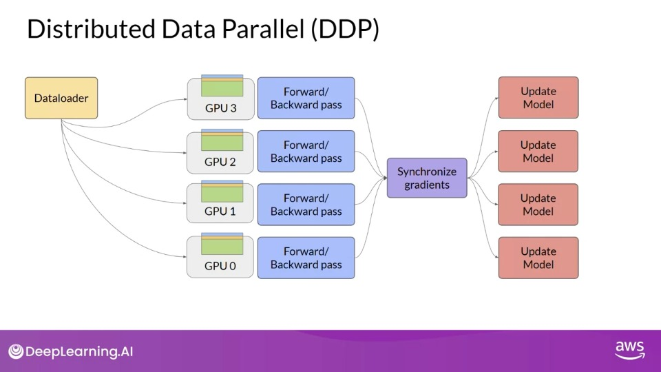

## Fully Sharded Data Parallel (FSDP)
- When a model is too big to fit onto a single GPU, FSDP is used. FSDP is a PyTorch implementation based on the ZeRO (Zero Redundancy Optimizer) technique, which distributes **model states** across GPUs with no data overlap.
- FSDP distributes data, model parameters, gradients, and optimizer states across GPUs.
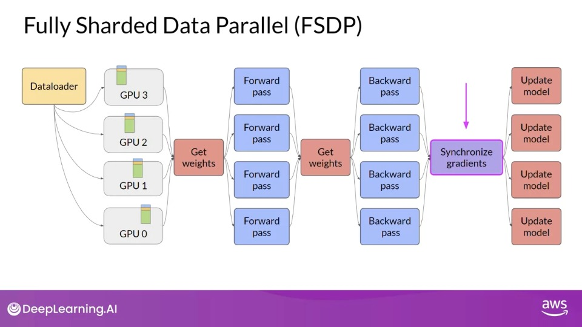  

### ZeRO Technique
- ZeRO aims to reduce memory consumption by sharding the model parameters, gradients, and optimizer states across GPUs.
- Three optimization stages of ZeRO:
  - ZeRO Stage 1: Shards only optimizer states across GPUs, reducing memory footprint by up to a factor of four.
  - ZeRO Stage 2: Shards gradients across GPUs, reducing memory footprint by up to eight times when combined with Stage 1.
  - ZeRO Stage 3: Shards all components including the model parameters across GPUs. When combined with Stages 1 and 2, memory reduction is linear with the number of GPUs.
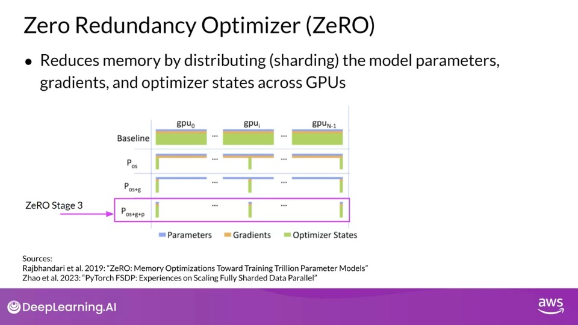

## FSDP vs DDP Performance
- For models up to 2.28 billion parameters, the performance of FSDP and DDP is similar.
- For larger models, DDP will run into out-of-memory errors. Using FSDP it is distributed across more GPUs, but increase in communication volume between GPUs can impact the performance, slowing down computation.

# Scaling laws and compute optimal models 

Pre-training aims to maximize the model's performance, which involves minimizing loss when predicting tokens. Options for better performance - Increase dataset size and Increase number of model parameters

## Compute budget

- **Compute budget** includes factors like the number of GPUs and time available for training models.

- Unit of compute - **petaFLOP per second day**: number of floating-point operations performed at a rate of one petaFLOP per second for an entire day. 
- **petaFLOP** = one quadrillion floating-point operations per second.
- Bigger models require more compute resources and data for good performance.
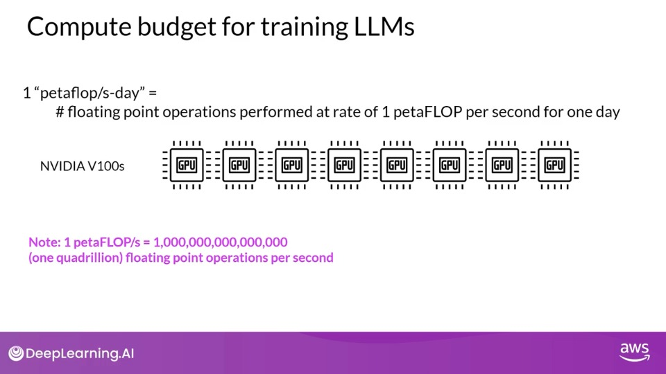
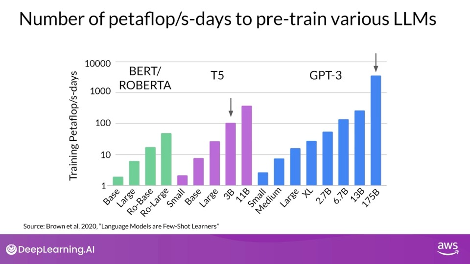

## Scaling choices 
- Scaling choices: training dataset size, model size, compute budget.
- Relationship between compute budget and model's performance approximated by a power-law relationship.
- Power law: mathematical relationship where one variable is proportional to the other raised to some power.
- Improving model's performance (with fixed compute budget):
  - Increase size of training dataset
  - Increase number of parameters in the model
- Training dataset size and model size also show a power-law relationship with test loss.
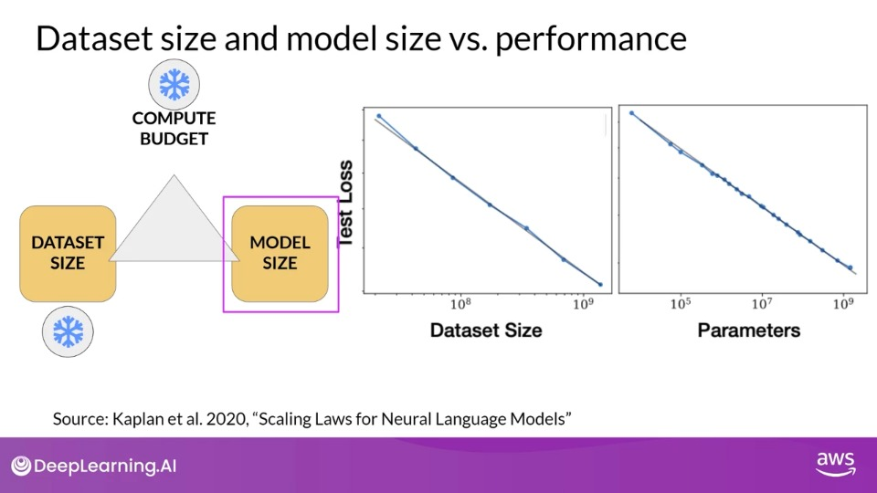

## Chinchilla Paper

- Chinchilla Paper: Optimal number of parameters and volume of training data for a given compute budget.
- Chinchilla paper findings:
  - 100 billion parameter large language models may be over parameterized and under trained.
  - Optimal training dataset size for a model is 20 times larger than the number of parameters in the model.
  - Compute optimal models outperform non-compute optimal models on a range of evaluation tasks.
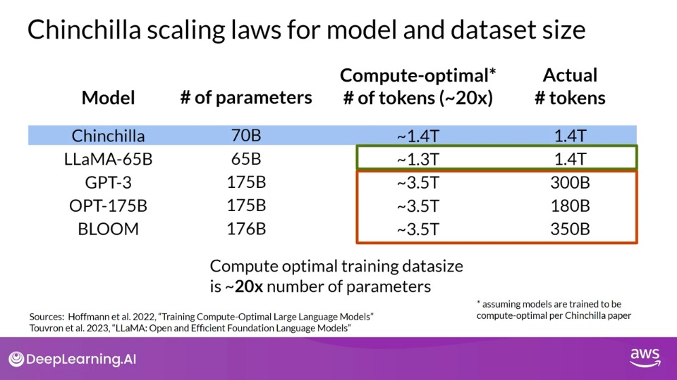

  
## Future trend: 
Deviation from 'bigger is always better', optimizing model design, training smaller models for better or similar results.
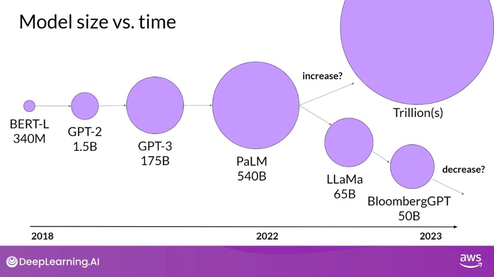

# Pre-training for domain adaptation
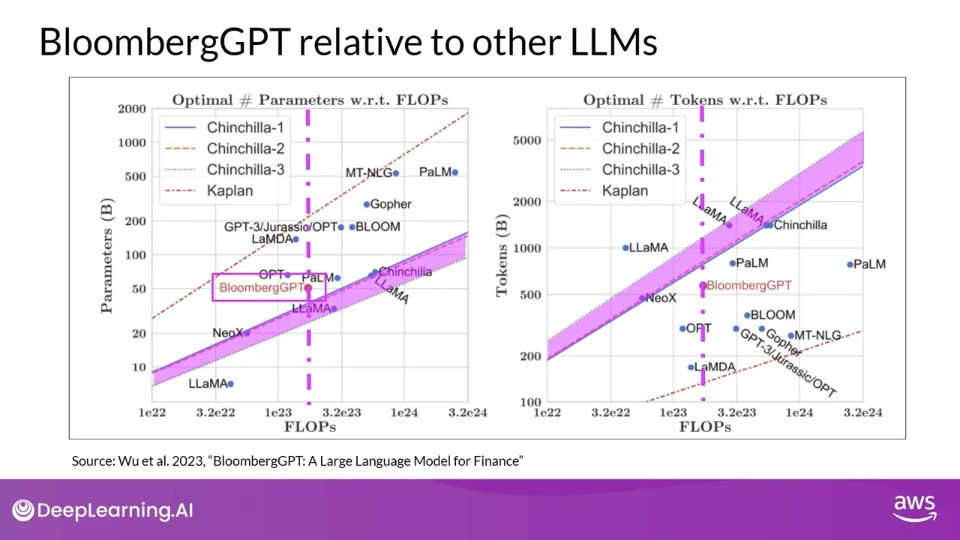
